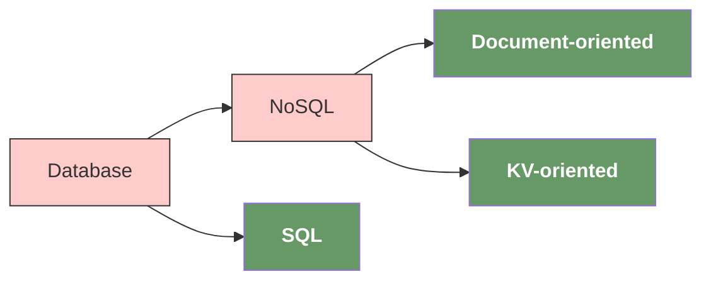
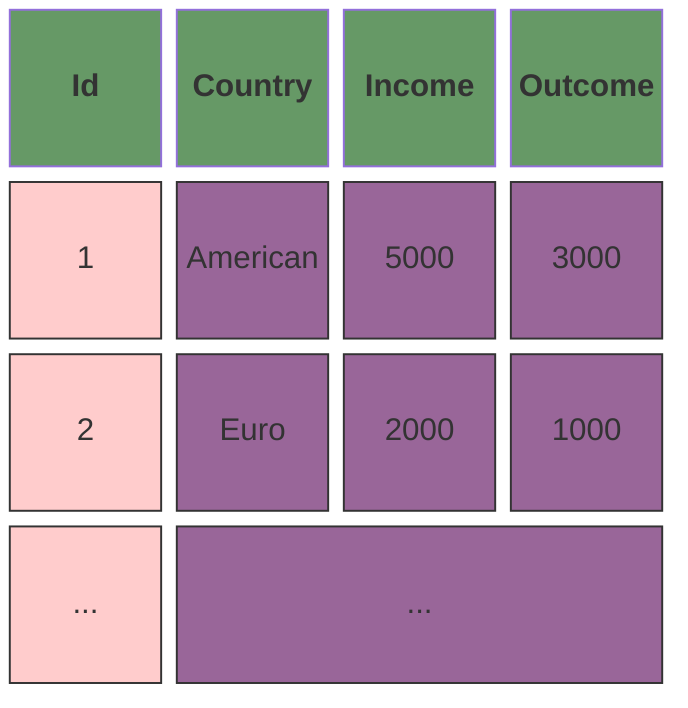
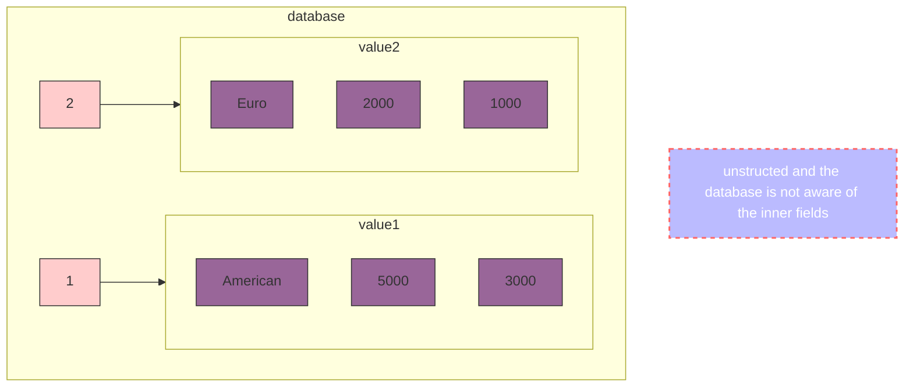
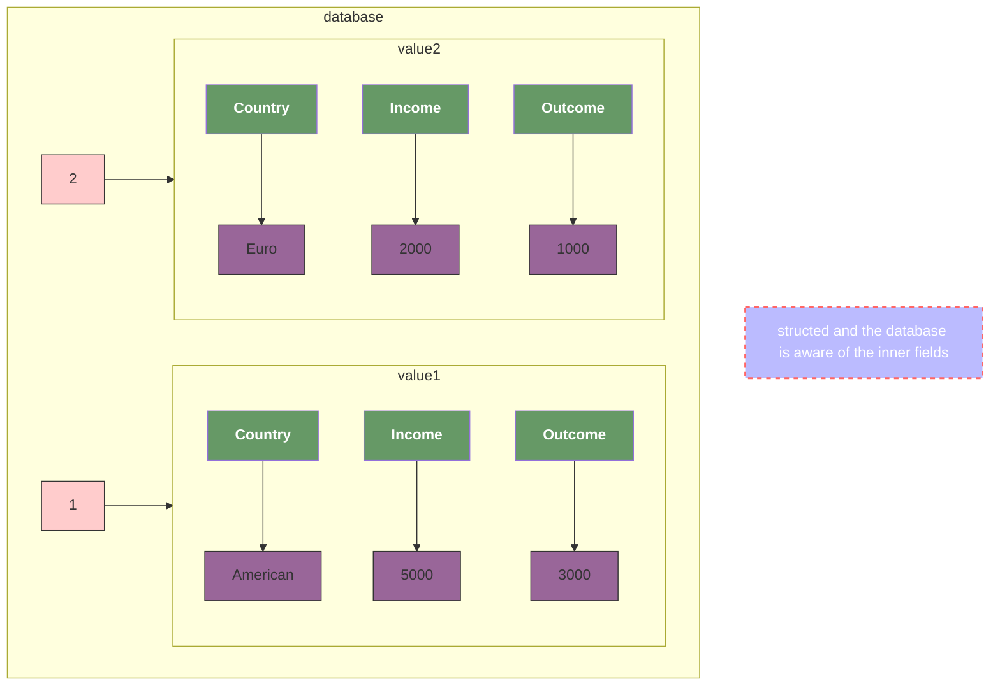

# elephant

## [NoSQL](./nosql/readme.md)

Build a `NoSQL` from scratch, to be done.

## [SQL](./sql/readme.md)

a toy relational database as a extension to [simple-lsm-db](https://github.com/0x822a5b87/simple-lsm-db), and the B-Plus-Tree is optimized based on another toy project of myself : [tiny-b-plus-tree](https://github.com/0x822a5b87/tiny-tree/tree/main/b-plus-tree).

## difference between SQL and NoSQL

The most prominent difference between SQL and NoSQL is the data model used by the database.

### SQL

### KV

### Document

## reference

- [Build a NoSQL Database From Scratch in 1000 Lines of Code](https://betterprogramming.pub/build-a-nosql-database-from-the-scratch-in-1000-lines-of-code-8ed1c15ed924)
- [Mini-Redis on Rust](https://tokio.rs/tokio/tutorial)