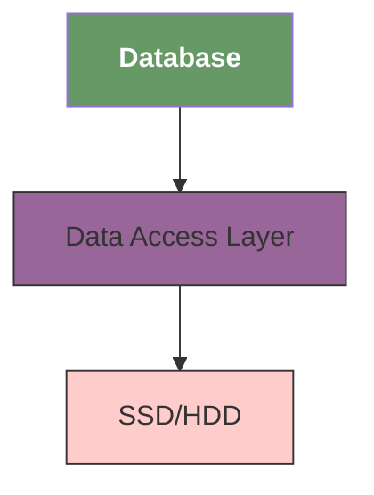

# nosql

## reference

- [Build a NoSQL Database From Scratch in 1000 Lines of Code](https://betterprogramming.pub/build-a-nosql-database-from-the-scratch-in-1000-lines-of-code-8ed1c15ed924)
- [Mini-Redis on Rust](https://tokio.rs/tokio/tutorial)

## build

```bash
cmake .
```

## intro

Build a `NoSQL` from scratch.

Databases use different data structures to organize pages on the disk, mostly B/B+ Trees and Hash buckets.

We will use B+Tree since it allows for easy implementation, but its printciples are close to what is used in a real-world databases.

## design



1. `Database` manages our program and is responsible for orchestrating transactions;
2. `Data Access Layer (DAL)` handles all disk operations and how data is organized on the disk;