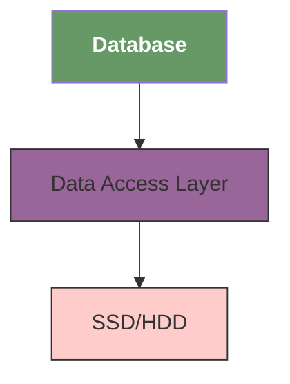
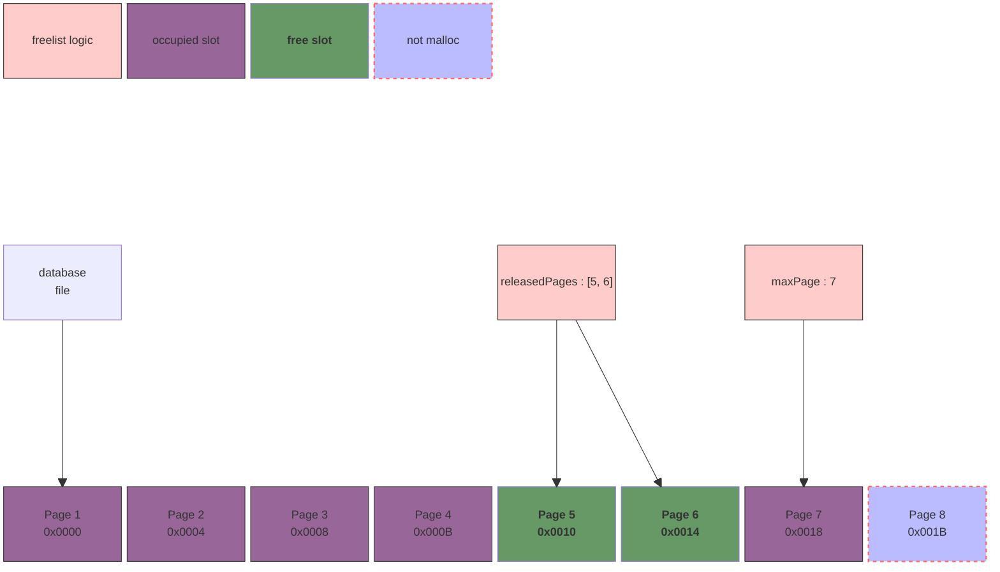
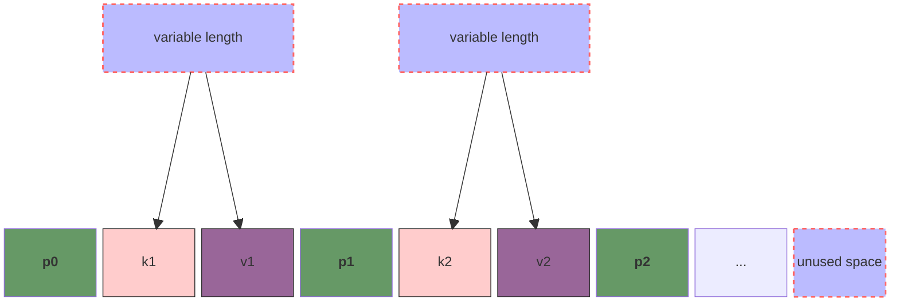
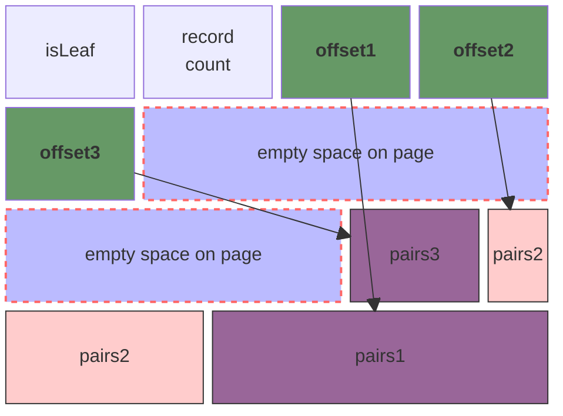
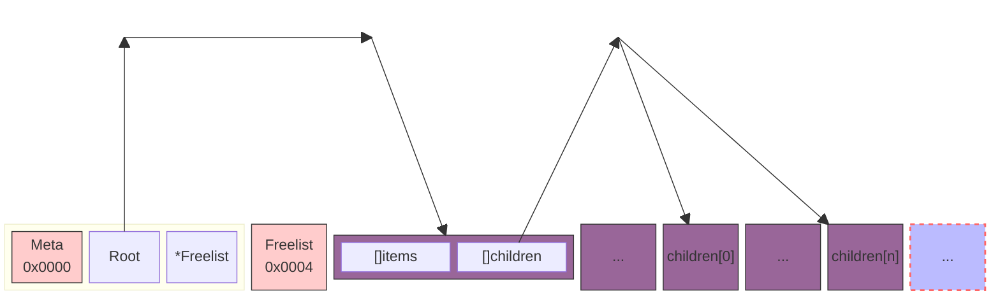

# nosql

## reference

- [Build a NoSQL Database From Scratch in 1000 Lines of Code](https://betterprogramming.pub/build-a-nosql-database-from-the-scratch-in-1000-lines-of-code-8ed1c15ed924)
- [Mini-Redis on Rust](https://tokio.rs/tokio/tutorial)

## build

```bash
cmake .

make
```

## intro

> _I have to mention that C++ is really not my preferred type. Poor package management, poor IDE support, and obscure syntax have caused me to spend a lot of time on some useless syntax details. Perhaps it's just because I'm not familiar enough with C++, but it does frustrate me a lot._

Build a `NoSQL` from scratch.

Databases use different data structures to organize pages on the disk, mostly B/B+ Trees and Hash buckets.

We will use B+Tree since it allows for easy implementation, but its printciples are close to what is used in a real-world databases.

## design



1. `Database` manages our program and is responsible for orchestrating transactions;
2. `Data Access Layer (DAL)` handles all disk operations and how data is organized on the disk;

## Freelist

**Freelist** used to manage page's allocation, reclaim, and so forth, it is part of DAL:

1. It has a counter named `maxPage` indicating the highest page number allocated so far.
2. It has a attribute called `releasedPages` for tracking released pages.



## Node Page Structure

If we store the `Nodes` on a sequential space of disk, iterating over key-value pairs can be a non-trivial task since we can't know how many bytes the cursor should advance each iteration.



To solve that problem, we will use a technique called **slotted pages**. This structure store keys in a sequential order starts from head and store values in a reverse order starts from tail.

More specifically, the insert can be separeted into three steps:

1. increment record count;
2. append offset to the end of offsets sequentially;
3. append pair to the end of pairs in reverse order.



### database structure

1. Each `Node` is stored in a `Page` of the DB;
2. Each `Node` contains `N` pairs and `N+1` children, we search in the disk until either **find the result** or **reach a leaf**.

