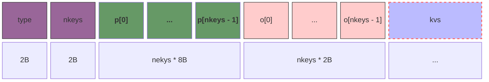
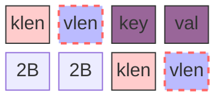
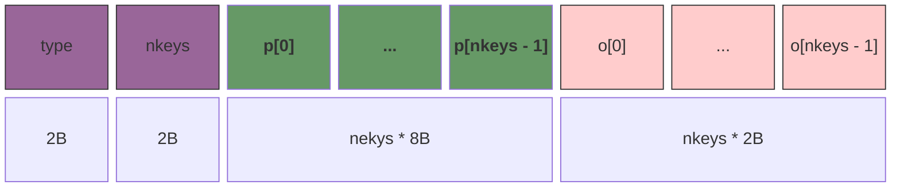
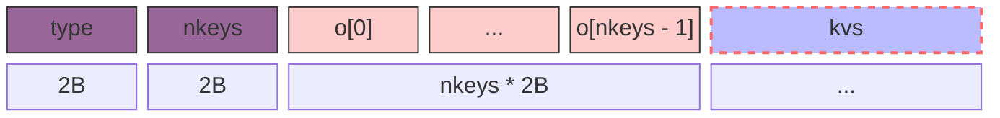
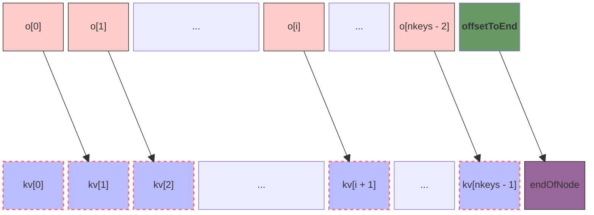
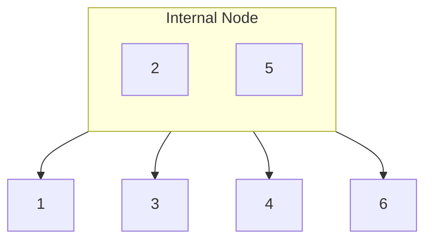
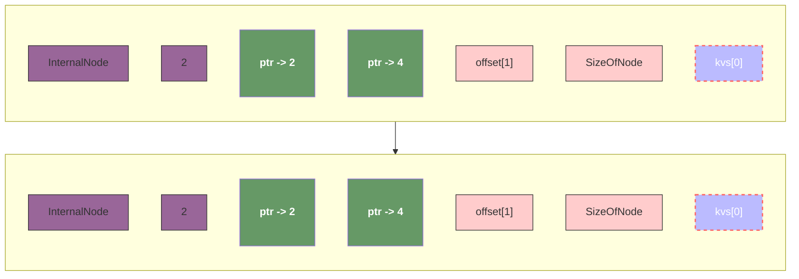

# SQL

## B+ Tree

A node consist of :

1. A fixed-sized header containing the **type of the node** (leaf node or internal node) and the **number of keys**;
2. A list of pointers to the child nodes. (Used by internal nodes);
3. A list of offsets pointing to each key-value pairs;
4. Packed KV pairs;

A internal node consist of :

1. A list of pointers to its children.
2. A list of keys paired with the pointer list. **Each of the keys are the first key of the corresponding child**.

### Regular format

>1. The offset is relative to the position of the first KV pairs; More specifically:
>   1. The position of `kv[0]` is : **Header + n * 8 + n * 2** which is a constant value for a certain node, let's say this value is `position`;
>   2. The position of `kv[1]` is **position + len(kv[0])**, but what is the value of **len(kv[0])** ? As you think, it's **offset[0]**;
>   3. More further, `kv[2]` is **position + len(kv[0]) + len(kv[1])** that equals to **position + offset[0] + offset[1]**.
>   4. Now, we are in the face of one severe question: we have to make a huge number of calculation when we are trying to access `kv[I]`. It's equals to _position + len(kv[0]) + ... + len(kv[I-1])_;
>   5. So, we simplify the question by save the final offset in the array _offset[I]_:
>      1. _kv[0]_ = _position_, therefore we don't need to store offset of _kv[0]_;
>      2. _kv[i] = position + len(kv[0]) + ... + len(kv[i-1])_, and we can make : _offset[I] =len(kv[0]) + ... + len(kv[I-1])_
>2. **The offset of the first KV pairs is always zero, so it is not stored in the list of offsets**.
>3. We store the offset to the end of the last KV pair in the offset list, which is used to determine the size of the node;
>4. You might notice an interesting detail of the configuration of the node that we don't store the offset of the first kv pairs, though the length of ptrs stills equals to the length of offsets. That's because we store an extra information for the size of the node as the description in <3>. The configuration of a node with 2 keys looks like this :
>   1. `Type` -> `2` -> `ptr[0], ptr[1]`, -> `offset[1], SizeOfNode`, -> `kv[0], kv[1]`

### Internal Nodes

### Leaf

> `TODO` Figure out how to map offsets to key-value pairs.

### mapping relationship between offsets and KV pairs

1. len(offsets) == nkeys && len(kvs) == nkeys;
2. We have nkeys of kv pairs and we have nkeys - 1 of offset pointer to kv pairs;
3. offsets[nkeys - 1] point to endOfNode, which is the size of current node.
4. In conclusion, we don't save the offset of first kv pairs and then shift all the remaining elements to the left for one step; After that, we fill a special offset in the end of the array which point to the end of kv pairs that indicate the size of current node.

### Examples

> ​	TODO Figure out the actual configuration of both nodes, including internal node and leaf node.

Assuming we have a B+ Tree as follows:

## references

- [tiny-b-plus-tree](https://github.com/0x822a5b87/tiny-tree/blob/main/b-plus-tree/readme.md)
- [google's btree in go](https://github.com/google/btree.git)
- [Build Your Own Database From Scratch in Go](https://build-your-own.org/database/)
